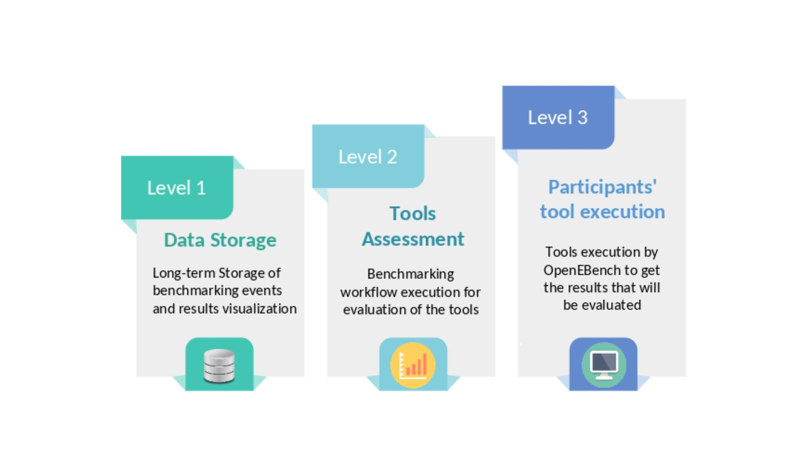
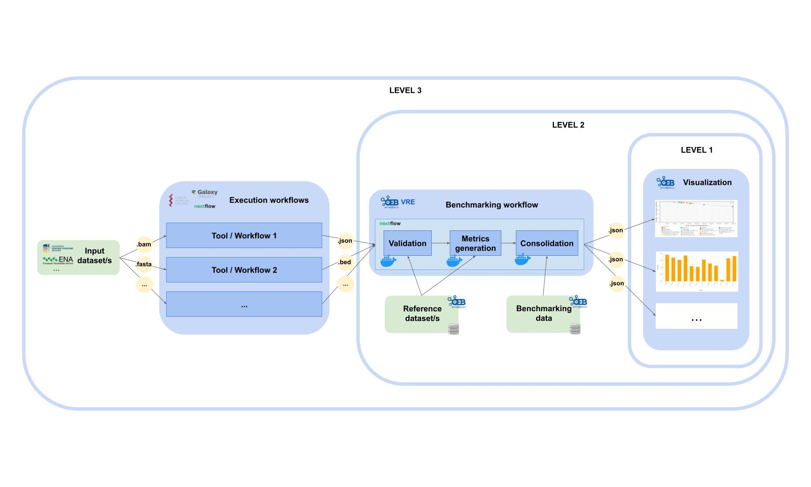

# Community-driven Scientific Benchmarking efforts

## Basic concepts

Unbiased and objective evaluations of bioinformatics resources are often challenging to set-up and can only be effective when built and implemented around community driven efforts. It is a complex process entirely relying on intense cooperation among the members of the community. These communities can be effectively strengthened by challenge-based competition with clear participation rules, a scientific sound set of questions, and agreed common data sets. Provided a critical mass of software developers is reached, competition eventually ends up bringing stimulated rewards and invaluable feedback about potential improvements for individual solutions.

Communities are a group of people that face similar problems and want to collaborate in finding the best solutions and resources to face them. The communities are going to define how the performance of the resource should be evaluated, which includes the definition of the metrics and reference datasets that they want to use for the benchmarking, which sometimes is not an easy task since they should reflect existing challenges of the scientific community in terms of size, complexity, and content. Also, the metrics that are used to measure the performance of individual participants should reflect the common practices in the field.

OpenEBench has engaged with different communities offering assistance to bring their data and activities into the platform. However, how communities use the platform depends on their specific needs and resources. Benchmarking of bioinformatics software also adds value to the communities by providing objective metrics in terms of scientific performance, technical reliability, and perceived functionality. At the same time, target criteria agreed within a community are an effective way to stimulate new developments by highlighting challenging areas. To ensure the long-term sustainability of OpenEBench, a co-production model is implemented to accelerate the incorporation of new communities and the maintenance of the existing ones.

Communities can focus on specific problems, e.g. [Quest for Orthologs (QfO)](https://openebench.bsc.es/scientific/OEBC002); or having a broader spectrum e.g. Spanish Network of Biomedical Research Centers on Rare Diseases [(CIBERER)](https://openebench.bsc.es/scientific/OEBC004); or covering different challenges on each of their editions, e.g. DREAM Challenges. Benchmarking efforts led by scientific communities might have a national scope e.g. CIBERER; or a global one e.g., Global Microbial Identifier Initiative (GMI).

## Community engagement model

OpenEBench community engagement model has three different levels that allow communities at different maturity stages to make use of the platform.

-	**Level 1** is used for the long-term storage of benchmarking results aiming at reproducibility and provenance.
-	**Level 2** allows the community to use benchmarking workflows to assess participants’ performance. Those workflows compute one or more evaluation metrics given one or more reference datasets.
-	**Level 3** goes further and the whole benchmarking process is performed at OpenEBench. Therefore, in this level, the participants’ tools that are going to be evaluated are also run by OpenEBench.

Importantly, each level makes use of the characteristics defined in the previous level e.g. participants’ data generated by workflows at Level 3 are evaluated using the metrics and reference datasets in Level 2, and the resulting data is stored following the data model in Level 1 for private and/or public consumption.

## OpenEBench benchmarking process

The benchmarking process starts in the execution of the tools or workflows with some input datasets in order to get the predictions that are going to be used for the benchmarking. It is recommended that the input datasets are stored in a public repository, like ENA or EGA. This implmentation in OpenEBench is still under construction and therefore it should be run by the members of the community previously. This can be done, for example, using Galaxy, Nextflow or Common Workflow Language.

Once the predictions are available, it is possible to run the benchmarking workflow which includes three steps: validation, metrics computation and results consolidation. During the validation, the input file format is checked and the content of the file is validated. Then, during the metrics computation, the predictions are compared with the reference datasets in order to evalaute the performance of each tool by different metrics. Finally, during the consolidation, the results of a particular tool are merged into the community's data. This step is performed in the [Virutal Research Environment (VRE)](https://openebench.bsc.es/vre//workspace/) and it allows the community to use benchmarking workflows to assess participants' performance.

The final step of the bechmarking process is the long-term storage of benchmarking events and challenges to make the results of the performance of the tools avilable in the [OpenEBench webpage](https://openebench.bsc.es/dashboard). It is important that researchers can access these results at any time, and have the tools to assist them in understanding them.

