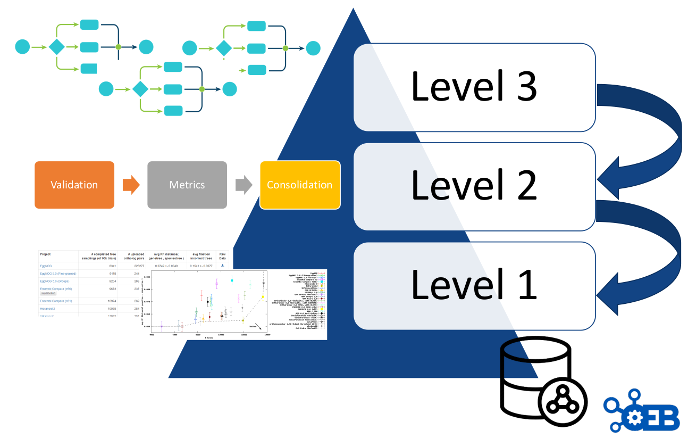

## Description
Scientific benchmarking helps determine the precision, recall and other
metrics of bioinformatics resources in unbiased scenarios, which have
been set up through reference databases, ad-hoc input and test data sets
reflecting specifying scientific challenges. Chosen metrics allow us to
objectively evaluate the relative scientific performance of the
different participating resources. It is even possible to understand
what are the software potential biases, strengths and weaknesses and/or
under which conditions do they perform better or worse..

Importance of communities
--------------------------------------------------

Unbiased and objective evaluations of bioinformatics resources are
challenging to set-up and can only be effective when built and
implemented around community driven efforts. Several communities from
different scientific domains collaborate with OpenEBench in order to
set-up, host and further develop their scientific efforts. These efforts
provide a way for software developers to implement more efficient
methods, tools and web services by comparing their performance on
previously agreed data sets and metrics with other similar resources
and, more importantly, help end-users that tend to have difficulties in
choosing the right tool for the problem at hand, and are not necessarily
aware of the latest developments in each of the fields of the
bioinformatics methods they need to use.

Communities can focus on specific problems, e.g. [Quest for Orthologs
(QfO)](https://openebench.bsc.es/scientific/OEBC002); or
having a broader spectrum e.g. Spanish Network of Biomedical Research
Centers on Rare Diseases
[(CIBERER)](https://openebench.bsc.es/scientific/OEBC004); or
covering different challenges on each of their editions, e.g. DREAM
Challenges. Benchmarking efforts led by scientific communities might
have a national scope e.g. CIBERER; or a global one e.g., Global
Microbial Identifier Initiative (GMI).

Most communities have similar needs in terms of reference data sets,
metrics, and benchmarking results accessible within the community and
beyond, independently of the scientific challenges tackled by each
community and their geographical scope. Data sets should reflect
existing challenges of the scientific community in terms of size,
complexity, and content. Moreover, data sets are used for producing
predictions by participants and to compute the performance of each
participant when comparing their predictions against a previously
agreed, often private, data sets that are referred many times as golden
data sets. Metrics are used to measure the performance of individual
participants and should reflect the common practices in the field.
Finally, making results available to the community and beyond is as
relevant as generating them. It is important that researchers can access
these results at any time, and have the tools to assist them in
understanding them. Moreover, associated data and metadata to any
benchmarking efforts should fulfill the FAIR principles and be available
in long-term repositories such as [Zenodo](https://zenodo.org/) and/or [EUDAT](https://eudat.eu/) with permanent digital
identifiers for further use and re-use.

Thus, OpenEBench has engaged with different communities offering
assistance to bring their previously generated data and activities into
the platform. Communities can make use of any of the three available
levels in the OpenEBench architecture. However, how communities use the
platform depends on their specific needs and resources. To ensure the
long-term sustainability of OpenEBench, we are implementing a
co-production model to accelerate the incorporation of new communities
and the maintenance of the existing ones.

OEB architecture levels
---------------------------------------------------

OpenEBench scientific benchmarking architecture has three different
levels that allow communities at different maturity stages to make use
of the platform.

-   **Level 1** is used for the long-term storage of benchmarking events and challenges aiming at reproducibility and provenance.

-   **Level 2** allows the community to use benchmarking workflows to assess participants' performance. Those workflows compute one or more evaluation metrics given one or more reference datasets.

-   **Level 3** goes further by getting workflows specifications from participants, and then evaluating them in terms of technical and scientific performance. At this level, the whole benchmarking experiment is performed at OpenEBench; first, the predictions are made using the software provided by the participants, then, those predictions are evaluated with the benchmarking workflows, and, finally, the results are stored and visualized in the web server.

Importantly, each level makes use of the architecture defined in the
previous level e.g. participants' data generated by workflows at Level 3
are evaluated using the metrics and reference datasets in Level 2, and
the resulting data is stored following the data model in Level 1 for
private and/or public consumption.
