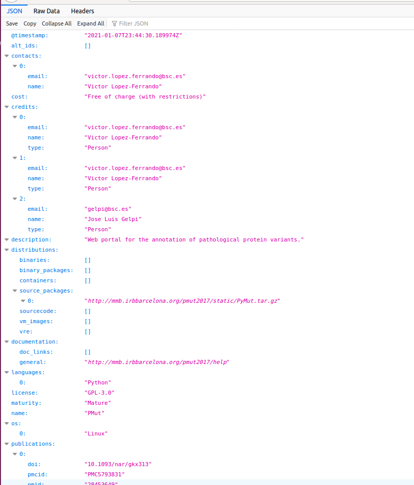
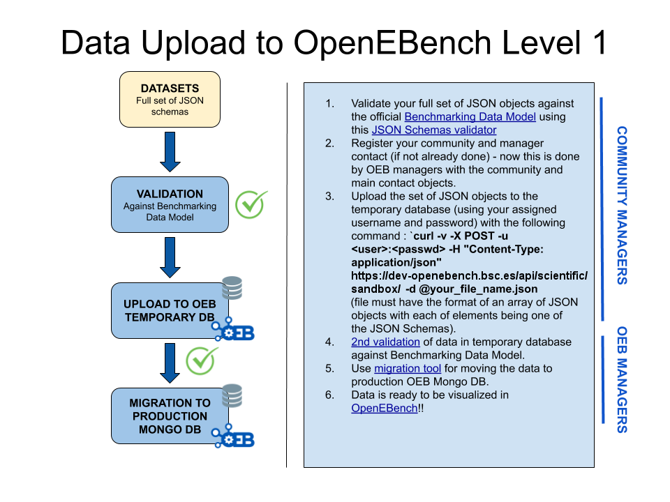

# Rest API

OpenEBench platform aims to be a central platform not only to generate,
but to publish and distribute benchmarking data across the scientific
community. To this end, a set of microservices are publicly offered as
REST APIs to retrieve data from the major OpenEBench repositories.

| Data Retrieval APIs           |                     URL                        | Source code | 
|-------------------------------|-----------------------------------------------------|-------------|
| OpenEBench Tools Monitoring   | [endpoint](https://openebench.bsc.es/monitor/)                  | [https://gitlab.bsc.es/inb/elixir/tools-platform/elixibilitas](https://gitlab.bsc.es/inb/elixir/tools-platform/elixibilitas)        |
| OpenEBench Scientific Upload  | [endpoint](https://openebench.bsc.es/api/scientific/submission/)| [https://gitlab.bsc.es/inb/elixir/openebench/openebench-submission-api](https://gitlab.bsc.es/inb/elixir/openebench/openebench-submission-api)        |        
| OpenEBench Scientific REST API | [endpoint](https://openebench.bsc.es/api/scientific/) | [https://gitlab.bsc.es/inb/elixir/openebench/openebench-rest-api](https://gitlab.bsc.es/inb/elixir/openebench/openebench-rest-api)        |        
| OpenEBench Scientific Retrieve|  [endpoint](https://openebench.bsc.es/sciapi/ )                  | Inab repo        | 

Those API's access OpenEBench MongoDBs instances (v4.2.5) and allow
users to query for the results they are interested in. Access to
OpenEBench is generally authenticated (although anonymous users can be
created). In those conditions data and tools access can be restricted as
required. OpenEBench will not provide data access credentials. Instead,
we will honor the agreements between data users and providers.

Information from these APIs is obtained in JSON format (see partial example on figure  below). 

It is relevant to note that information can be obtained for specific versions or specific deployments of the tool. This opens the possibility of performing historical analysis comparing the performance and/or availability of different resources versions. More information on  the API is available at https://gitlab.bsc.es/inb/elixir/tools-platform/elixibilitas.

## Data Upload

OpenEBench Community Managers can upload the results from their full
benchmarking event to the platform by using one of the scientific APIs
(https://openebench.bsc.es/api/scientific/submission/) . In
order to do that they have to:

1.  Covert their full experiment to the official [Benchmarking Data Model](#benchmarking-data-model) - datasets, tools, challenges... Please contact the OpenEBench team if you need any help in adapting your benchmarking process to the data model concepts.

2.  Validate the full set of generated JSON objects against the official [Benchmarking Data Model](#benchmarking-data-model) using this [JSON Schema validator](https://github.com/inab/extended-json-schema-validators).

3.  Register the community and manager contact (if not already done) - now this is done by OEB managers with the community and main contact objects. New managers will be assigned an username and password.

4.  Merge the set of JSON objects into a single array. In Linux systems, executing the following command in the root directory that contains all files does the trick : `jq -s . $(find . -type f -name "*.json") > your_file_name.json` (jq library needs to be installed).

5.  Upload the array of JSON objects to the temporary database (using the assigned username and password) with the following command : `curl -v -X POST -u <user>:<passwd> -H "Content-Type: application/json" https://dev-openebench.bsc.es/api/scientific/submission/?community_id=OEBC002 -d @your_file_name.json`

6.  2nd validation of data in temporary database against Benchmarking Data Model.

7.  Use the [migration tool](https://gitlab.bsc.es/inb/elixir/openebench/openebench-distiller-tool) for moving the data to production OEB Mongo DB.

8.  Data is ready to be visualized in [OpenEBench](https://dev-openebench.bsc.es/)!!

Please note that steps 6 and 7 are now performed by the OpenEBench team.

